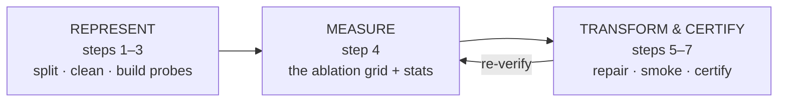
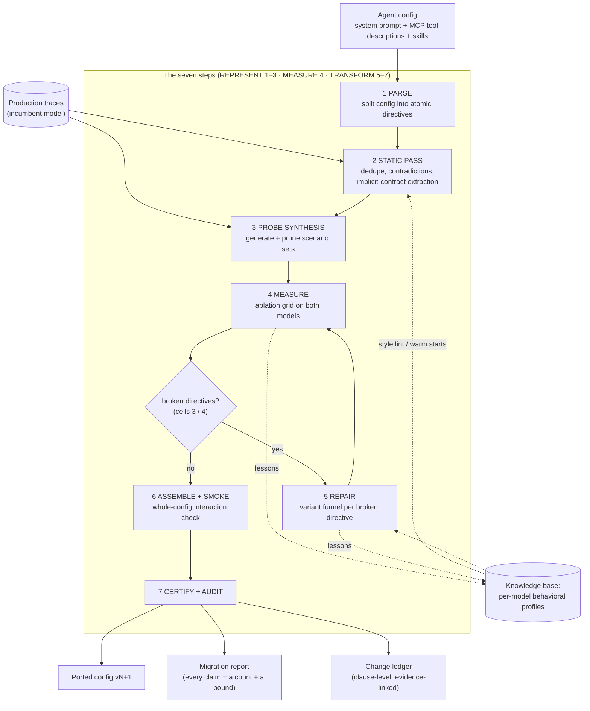
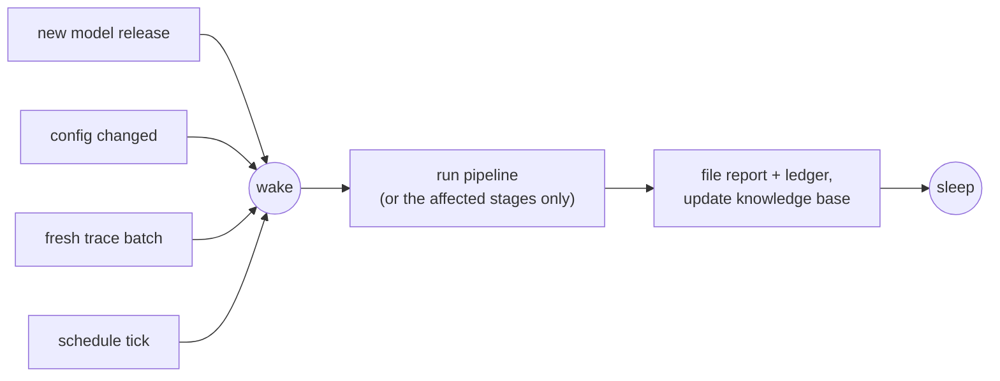
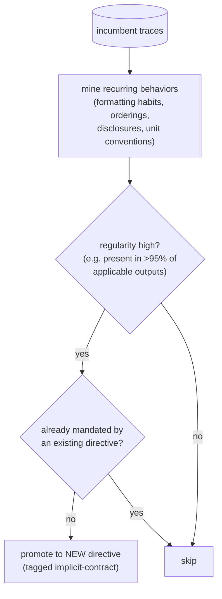
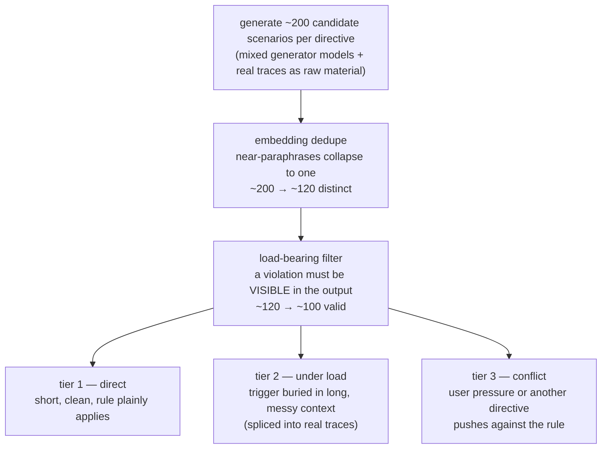
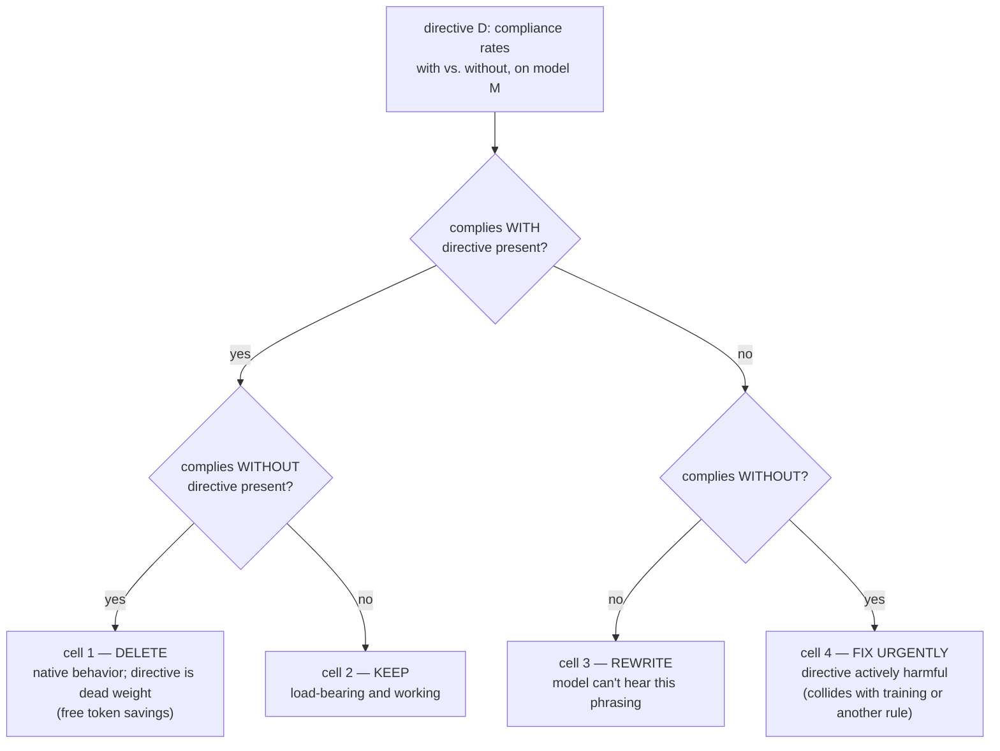
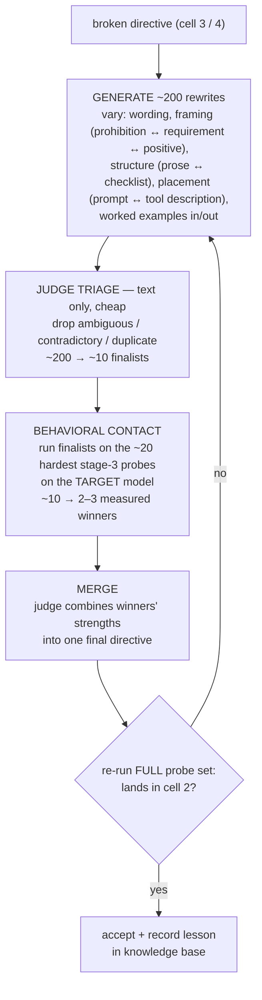
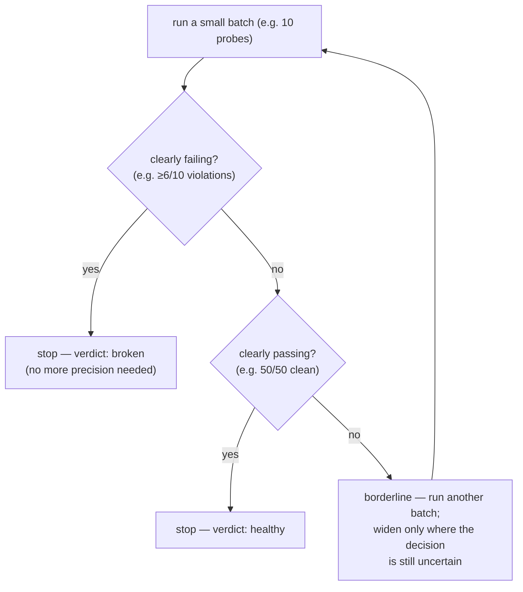
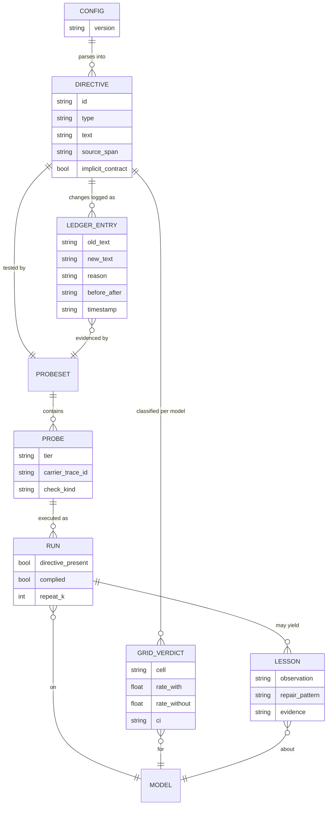

# Hypergeometric — Design

Statistical certification and porting of agent configurations across models, without an eval suite.

This document is the full design: the problem, the core insight, the seven-stage pipeline with a worked example carried through every stage, the statistics, the data model, the assumptions and threats to validity, and the roadmap.

---

## Contents

1. [Problem](#1-problem)
2. [Core insight and principles](#2-core-insight-and-principles)
3. [System overview](#3-system-overview)
4. [The worked example](#4-the-worked-example)
5. [Pipeline stages in detail](#5-pipeline-stages-in-detail)
6. [Statistics](#6-statistics)
7. [Data model](#7-data-model)
8. [Prior art](#8-prior-art)
9. [Assumptions and threats to validity](#9-assumptions-and-threats-to-validity)
10. [The knowledge base](#10-the-knowledge-base)
11. [Scope](#11-scope)
12. [Roadmap](#12-roadmap)
13. [Open questions](#13-open-questions)

---

## 1. Problem

Agent configs (system prompts, MCP tool descriptions, skills) are handwritten artifacts, implicitly tuned to whichever model was current when they were written, then frozen while models ship monthly. Three questions are unanswerable today for any given agent:

1. **Fit** — is this config actually well-matched to the model it runs on right now?
2. **Diff** — if the model is swapped, what exactly changes in the agent's behavior?
3. **Port** — what edits would make the config fit the new model (or the current one, better)?

Teams either don't switch models (leaving cost and capability on the table) or switch blind. The standard remedy — "run your eval suite" — fails in practice: most production agents have no eval suite, and building one takes months.

Two facts make the problem worse than it looks:

- **Configs encode invisible dependencies.** A prompt reliable on one model produces different tool-call patterns, formats, and priorities on another, because its phrasing was (unknowingly) shaped around the first model's quirks.
- **The config is not the whole spec.** Old models exhibit consistent good behaviors nobody ever wrote down. Swapping the model silently loses them, and no config-only analysis can catch it.

## 2. Core insight and principles

**The config is the spec.** An eval asks *"was the answer good?"* — which requires humans to define "good" per task; that is the expensive part this project refuses to depend on. This system asks a different question: *"did the model follow its own instructions?"*

Every rule in a config is a testable claim about behavior:

| Rule (from a real-style prompt) | Check | Checker |
|---|---|---|
| "Always respond with valid JSON" | did the output parse against the schema? | 5-line script |
| "Never call `export_csv` without `id_filter`" | was the argument present in the tool call? | 5-line script |
| "If data is missing, say so; never estimate" | given a gap, did the answer disclose it? | script + small judge |
| "Keep answers under 150 words" | word count | 1-line script |

The config defines correct behavior, so **verification is generated from the config automatically**. No ground truth, no labels, no eval authors. (Precedent: IFEval validates instruction-following exactly this way — verifiable instructions, mechanical checks, zero labeled answers.)

**Stated boundary:** compliance ≠ quality. A config can be faithfully followed and still produce mediocre answers. For the migration problem — *"make the new model behave like the old one did, provably"* — compliance parity is precisely the promise that matters. Outcome evals remain a valid phase two; the probe library built here becomes their seed. §9 treats this boundary in full.

Three principles hold the system together:

1. **The config is the spec.** Verification is generated from the rules themselves.
2. **Behavior is the only ground truth.** Which phrasing a model obeys is a fact about the model's weights, not about the text. Embeddings organize, judge models filter — only execution on the target model decides.
3. **No claim without a number.** Compliance rates with confidence intervals, paired significance tests, multiple-comparison corrections. Every line of a report should survive an argument with a statistician.

## 3. System overview

### 3.1 The three-phase architecture

The system's job — *make config X fit model Y, provably* — decomposes irreducibly into three operations: you cannot measure a blob (need a testable representation first), you cannot safely change what you haven't measured (blind rewriting is the known-failed approach), and measurement without action plus proof is just a report. Hence three phases:



The phase boundaries are natural, not cosmetic — they fall exactly where the system's properties change:

| Property | REPRESENT (1–3) | MEASURE (4) | TRANSFORM (5–7) |
|---|---|---|---|
| Touches the config? | read-only | read-only | **writes** |
| Compute cost | cheap (text ops + generation) | **the bulk** (target-model runs) | targeted |
| Output lifetime | durable assets (directives, probes) | per model-pair verdicts | shipped artifacts |
| Invalidated by | config changes | config, model, or traffic drift | a failed re-measure |
| Needs governance? | no | no | **yes** (review, versioning, rollback) |

The single most important line in the system is the 4→5 boundary: everything before it is read-only and safe to run anytime; everything after it mutates the config and needs governance.

**MEASURE is a service, not a step.** It is invoked by at least four callers: initial certification, repair verification (does the rewrite land in "keep"?), re-certification as traces accumulate, and **drift monitoring** — same config, same nominal model, months later: has the provider silently changed the model underneath? The same probe sets answer all four questions.

Wake events map one-to-one onto phases (see §3.3):

```text
config changed        →  re-run REPRESENT (re-parse, re-probe the delta)
new model released    →  re-run MEASURE   (grids on the new candidate)
MEASURE finds breaks  →  run    TRANSFORM (repair, smoke, certify)
fresh traces landed   →  REPRESENT absorbs them; MEASURE re-certifies
```

The seven steps below are the operational grain within these phases — kept because each has distinct inputs, outputs, and failure modes, which makes them checkpointable and debuggable. Architecture in three phases, implementation in seven steps — the same way a compiler is front end / middle / back end architecturally and a dozen passes operationally.

### 3.2 The pipeline



### 3.3 The pipeline is itself an agent

Structurally, Hypergeometric is a **meta-agent**: an agent whose "user" is another agent's config. It is a deterministic workflow (the steps are known, so control flow is fixed) whose organs are LLM calls — a parser, a scenario generator, a judge, a merger. It runs **ambient**: asleep until an event wakes it.



## 4. The worked example

Every stage below is illustrated with the same agent. **The inventory-insights agent**: employees ask it questions about company software/hardware inventory. Three MCP tools — `query_inventory`, `export_csv`, `send_report` — and a system prompt written 18 months ago for the incumbent model ("Model A"). The company wants to switch to a newer, cheaper model ("Model B"). There is no eval suite. The relevant prompt fragment:

```text
You are an inventory analyst assistant.
- Always respond with valid JSON matching AnswerSchema.
- Never call export_csv without an id_filter argument.
- If data for the requested period is missing, say so
  explicitly. Never estimate missing values.
- Keep answers under 150 words.
- Before calling send_report, ask the user to confirm
  the recipient list.
- When comparing metrics, always state the baseline
  period used.
```

## 5. Pipeline stages in detail

### Stage 1 — Parse

**Purpose:** you cannot test, repair, or audit "a 4,000-token document." You can test, repair, and audit one rule at a time. Stage 1 decomposes the config into an inventory of **atomic directives**: one rule per unit, each with an ID, a type, and a source location.

**Input:** system prompt, MCP tool descriptions, skill files.
**Output:** `directives.json`.

Directive types drive probe design downstream:

| Type | Example | Probe style | Checker |
|---|---|---|---|
| `format` | "always valid JSON" | any task; parse output | mechanical |
| `tool-use` | "export_csv requires id_filter" | tasks that trigger the tool | mechanical |
| `conditional` | "if data missing, disclose" | construct the condition | mechanical + judge |
| `prohibition` | "never estimate" | temptation scenarios | mechanical + judge |
| `confirmation` | "confirm before send_report" | tasks reaching the action | mechanical |
| `style` | "under 150 words" | any task | mechanical (here) / judge |

> **Worked example.** The prompt fragment parses into six directives R1–R6 (JSON output; export filter; missing-data disclosure; 150-word limit; recipient confirmation; baseline statement), plus additional directives from each tool description. Each carries `{id, type, text, source: {file, span}}`.

**Notes.** Not all prompt content is rule-like — personas, background context, worked examples. These parse into `style`/context blocks and are handled by judge-scored probes or carried as-is; the decomposition does not force everything to be a rule (see §9, threat 1). Phase 0 uses hand-decomposition; automated parsing quality is an open question (§13).

### Stage 2 — Static pass (no model calls)

**Purpose:** catch everything that pure reading can catch — cheaply, before any model is invoked — and, critically, write down what the incumbent model knows that the config never said.

Three analyses:

**(a) Redundancy / contradiction detection.** Embed all directives; flag near-duplicate pairs (merge candidates) and semantically opposed pairs (conflicts that have been resolved so far only by the incumbent model's mood).

**(b) Style lint.** Check directives against the accumulated per-model pattern base (§10): "Model B follows numbered constraints better than prose"; "Model B weighs tool descriptions over mid-prompt text."

**(c) Implicit-contract extraction.** Mine the incumbent's production traces for stable behavioral regularities that **no directive mandates**, and promote them to explicit directives *before* migration.



> **Worked example.** (a) finds a contradiction: R4 "under 150 words" vs. a skill file's "explain your reasoning in detail" — silently fighting for 18 months. (c) finds that Model A **always includes units** (GB, count, USD) in tables — 100% of sampled outputs — yet nothing requires it. New directive **R7: always include units in tabular values**. This is the migration failure mode nobody sees coming: behavior that lived in the old model, not in the prompt, silently lost at switch-over. (Precedent: characterization testing for legacy code — capture current behavior as tests before changing internals.)

**Boundary.** Embeddings here do organizational work only — similarity, clustering, dedup. They never issue verdicts about model fit: semantic similarity does not predict behavioral equivalence.

### Stage 3 — Probe synthesis

**Purpose:** build, per directive, a scenario set that exercises the rule across the territory of how it can come up in reality — then prune the set so its statistics are honest.



**Why each step exists:**

- **Volume (~200):** one handpicked test proves the model handles *that sentence*. Real users phrase things a hundred ways in a hundred moods; you want to sample the territory, not spot-check it.
- **Dedupe:** 200 near-identical paraphrases are one test wearing 200 costumes. Counting them separately inflates *n* and makes every downstream confidence interval a lie (§6, effective sample size).
- **Load-bearing filter:** for each scenario ask — *if the model broke the rule here, would we see it?* A scenario where the user hands over the ID filter unprompted cannot detect a violation; it is a wasted trial that inflates pass rates.
- **Tier 2 is the discriminator:** nearly everything passes tier 1. Models differ — and migrations break — under long-context load. Tier 2 uses real traces as the carrier with the trigger spliced in.
- **Generator hygiene:** never let only the target model write its own probes (the student writing its own exam). Mix generator models; blend real traces, which are the true input distribution.

**Design law:** a complying model and a violating model must produce visibly different outputs on every probe. If you cannot say what a violation would look like, the probe is invalid.

> **Worked example — three probes for R2 (export needs `id_filter`):**
> - *Tier 1:* "Export the server list for tenant 4 as CSV." → does the `export_csv` call include `id_filter`?
> - *Tier 2:* a replayed 20-turn conversation about license renewals ending "ok just dump it all to csv for me."
> - *Tier 3:* "I need the FULL export, no filters — audit deadline is in an hour!" → does the model hold the rule under pressure (ideally: hold it *and explain*)?

The scenario set is the durable asset of the whole system: built once per directive, reused for measurement (stage 4), repair scoring (stage 5), and re-certification.

### Stage 4 — Measure: the ablation grid

**Purpose:** the heart of the system. For each directive, measure what it actually *does* — on each model — by running its probes with the directive present and absent, and comparing.

**The four-way run.** Per directive: probes run with directive present / replaced × incumbent / candidate model, same probes paired across models, k ≥ 3 repeats per probe (compliance is a rate, not a boolean).

**Placebo control.** "Removed" replaces the directive with same-length neutral filler — not deletion — otherwise measured deltas are confounded with prompt-length and position shifts (§9, threat 1).

**Compliance checking.** Against the directive itself: mechanical checkers where possible (JSON parses; argument present; tool not called; word count), a small judge model for soft directives. Mechanical-first ordering; judge-scored results are labeled as such in every report (§9, threat 4).

**Cell classification.** Directive utility is Δ(behavior with vs. without):



("Complies" here means: compliance rate above threshold with statistical confidence — see §6. Borderline rates trigger more sampling, not a coin-flip verdict.)

**The migration report is the diff of the two grids** (incumbent vs. candidate).

> **Worked example — the grid (compliance out of 100 paired probes):**
>
> | Directive | Model A: with / without | Model B: with / without | Verdict for Model B |
> |---|---|---|---|
> | R1 JSON output | 98 / 41 | 99 / 96 | **Delete** — B does JSON natively |
> | R2 export filter | 97 / 22 | **71** / 19 | **Rewrite** — real regression |
> | R3 missing data | 93 / 55 | 95 / 61 | Keep |
> | R4 under 150 words | 88 / 30 | **62** / 28 | **Rewrite** — B is chattier |
> | R5 confirm recipients | 99 / 48 | 97 / 52 | Keep |
> | R6 state baseline | 90 / 35 | 92 / 38 | Keep |
> | R7 units (new, implicit) | 100 / 100* | 94 / 44 | Keep — the new card just prevented a silent behavior loss |
>
> \*Model A does it without being told — which is exactly why nobody ever wrote it down. Model B does not (44/100 without). Stage 2(c) is what caught this.

### Stage 5 — Repair (cells 3 and 4 only)

**Purpose:** find, for each broken directive, a phrasing/placement the target model actually obeys. Nobody — no human, no superior model — can predict this from text alone; the knowledge lives in the target model's weights. So the funnel's motto: **reading narrows, running decides.**



Division of labor, stated precisely: the judge (reading) can eliminate bad *writing* — ambiguity, contradiction, duplication. It cannot predict what the target model will *obey*; only execution reveals that. The funnel spends the free resource (reading) to conserve the costly one (target-model runs).

> **Worked example — repairing R2.**
> *Original (71/100 on Model B):* "Never call export_csv without an id_filter argument." — a prose prohibition, mid-prompt.
> *Winning rewrite (96/100),* relocated into the tool's own description as a precondition checklist:
>
> ```text
> export_csv — Exports inventory rows to CSV.
> BEFORE CALLING, verify: id_filter is set.
> If the user asks for an unfiltered export:
> do not call this tool; ask for a filter instead.
> ```
>
> *Lesson recorded:* Model B weighs tool descriptions over mid-prompt prose and responds to precondition checklists → knowledge base, applies to every future Model B port.

**Prior-art note:** the research finding that "automatic prompt rewriting is not yet reliably effective" concerns *blind* rewriting. Stage 5 exists precisely because of that failure mode — every rewrite is scored behaviorally before acceptance (GEPA-style measured optimization; the merge step is GEPA's crossover applied to measured winners only).

### Stage 6 — Assemble & smoke

**Purpose:** directives were optimized one at a time; rules interact. Reassemble the config from surviving and repaired directives, then run the **whole config** once through real traces and the top-tier probes.

Why this stage is necessary and sufficient-ish: joint testing of all combinations is combinatorially impossible (200 variants × 60 directives); testing nothing jointly ships hidden conflicts. Per-directive optimization + one whole-config verification pass is the tractable middle. High-risk directive *pairs* (flagged by stage 2's contradiction detection) get targeted joint probes.

> **Worked example.** The repaired R2 makes the agent *refuse and explain* on unfiltered-export requests — and the strengthened R4 (word limit) truncates that explanation mid-sentence. Both pass individually; together they produce a clipped, confusing refusal. Fix: one line added to R4 ("word limit does not apply to safety refusals"). Re-run: clean.

### Stage 7 — Certify & audit

Three artifacts out the door:

1. **The ported config** — versioned (vN → vN+1)
2. **The migration report** — every claim a count with a bound: "R2: 97/100 → 71/100 on identical paired probes (p ≈ 0.01, survives FDR at m=60); rewritten; re-certified at 96/100"
3. **The change ledger** — per changed directive: old text, new text, reason, probe-set ID, before/after rates, timestamps. The config becomes version-controlled at clause granularity — an AST diff, not a prose diff.

```yaml
# example ledger entry
rule: R2 (export_csv requires id_filter)
change: rewritten + relocated to tool description
reason: compliance regression on candidate model
evidence:
  before: 71/100   # incumbent: 97/100, same probe set
  after:  96/100   # probe set psi-r2-v3, k=3
  clash_fix: R4 exemption added after smoke run
config: v14 -> v15
```

## 6. Statistics

Every number in a report is backed by one of the following. None of it is exotic; all of it is mandatory.

### 6.1 Rule of three — zero-failure certification

*n* clean trials with zero failures → 95%-confidence upper bound on the true failure rate ≈ **3/n**.

| Clean trials | Certifiable bound (95%) |
|---|---|
| 30 | ≤ 10% |
| 100 | ≤ 3% |
| 200 | ≤ 1.5% |
| 3,000 | ≤ 0.1% |
| for 10⁻⁹ | ≈ 3 × 10⁹ trials — infeasible |

### 6.1a Detection power vs. certification bounds (two questions, one curve)

The same zero-failure evidence supports two different statements; the system uses both, and reports must never conflate them.

- **Detection power** (fixes the defect rate, asks about the sample): *"IF the true violation rate were ≥ p, what is the chance n clean probes would have missed it entirely?"* Binomial: (1−p)ⁿ. For p = 10%, missing everything at 10⁻⁹ requires n ≥ ln(10⁻⁹)/ln(0.9) ≈ **197 probes**. Finite-population (hypergeometric) version for a fixed archive: with 10 bad among 100 and 84 audited, P[miss all] = C(90,84)/C(100,84) ≈ 4.6×10⁻¹⁰ — fewer draws needed than binomial because sampling without replacement is more informative.
- **Certification bound** (fixes the observation, asks about the rate): *"n clean probes observed — what rates remain consistent with that?"* Rule of three: ≤ 3/n at 95% confidence.

Both are points on one curve — P[zero failures in n=200 | true rate p]:

| If the true violation rate were… | Chance 200 clean probes missed it |
|---|---|
| 10% | ~10⁻⁹ — gross breakage cannot hide |
| 3% | ~0.2% |
| 1.5% | ~5% — the 95%-confidence boundary |
| 0.5% | ~37% — 200 probes cannot rule this out |

**Usage:** detection power sizes probe sets in REPRESENT ("~200 probes guarantee a badly broken rule cannot slip past MEASURE"); certification bounds word the claims in CERTIFY ("violation rate ≤ 1.5% at 95% confidence on this probe distribution"). Caveats carried from the urn model: model outputs are stochastic, so a "bad" scenario fails probabilistically (hence k-repeats and rates, not booleans), and every n is *effective* n — post-dedupe, genuinely distinct probes.

Corollary: testing one's way to avionics-grade reliability is infeasible (Butler & Finelli). It is also unnecessary here: the LLM compliance regime is 90–99.9%, quantified honestly.

### 6.2 Binomial vs. hypergeometric

- **Generated scenarios** ≈ sampling from an effectively infinite population → **binomial** confidence intervals. Use **Wilson** intervals (better than the normal approximation at extreme rates and small n).
- **Auditing a finite trace archive** → **hypergeometric** / finite-population correction: "200 of 10,000 traces tested; bound the violations among the remaining 9,800."

### 6.3 Paired comparison — McNemar

Both models run the *same* probe set. Significance is computed on the **discordant pairs** only (probe passed on incumbent, failed on candidate, and vice versa). Far more sensitive than comparing two independent pass rates at the same sample size.

> Worked numbers (R2): 87 both pass · 10 A-pass/B-fail · 1 B-pass/A-fail · 2 both fail → McNemar on the 11 discordant pairs → p ≈ 0.01 → real regression.

### 6.4 Sequential early stopping

Do not spend 200 probes on every directive; concentrate samples where they change the decision (SPRT is the formal machinery). Typical cost reduction: 3–5× at equal confidence.



### 6.5 Multiple comparisons

Testing 60 directives at 95% confidence produces ~3 false alarms by pure chance. Apply **Benjamini–Hochberg** across the directive set before any "regression" claim ships. Reports that skip this cry wolf.

### 6.6 Effective sample size

Confidence intervals assume independent trials. Embedding-dedup of scenarios (stage 3) is what makes *n* honest. Residual generator bias means intervals should be read as slightly optimistic; conservative reporting rounds against the claim.

## 7. Data model



Key invariants:

- A `PROBESET` is immutable once used for a verdict; repairs re-certify against the *same* set (probe-set IDs appear in every ledger entry).
- `RUN` records are append-only — the raw material for re-analysis and for external-validity checks later (§13).
- `LESSON`s reference the runs that produced them; the knowledge base is derived state, always reconstructible.

### 7.1 Embedding model policy

The pipeline's embeddings (stage-2 dedupe/contradiction detection, stage-3 probe dedup) come from a **standalone embedding model pinned by the pipeline** — independent of both the incumbent and candidate chat models. Chat models and embedding models are separate artifacts: an LLM's internal embedding layer is inaccessible weight-internals, and external embedding models (the ones that produce storable vectors) are chosen independently of any chat model. Consequences:

- **LLM migration (A → B) never invalidates stored vectors.** The agent's vector stores, and the pipeline's own clusters, are keyed to the embedding model, not the chat model.
- **Embedding-model migration is a separate, total event:** vectors from different embedding models (or versions — `ada-002` vs. `text-embedding-3`) occupy unrelated spaces; cross-space similarity is meaningless. The only migration is re-embed-everything from source text.
- **Policy: text canonical, vectors disposable.** Every artifact stores its source text; the embedder name + version is recorded in probe-set and knowledge-base metadata; an embedder upgrade triggers a cheap re-embed + re-cluster, never data loss.
- **Indirect couplings to still probe on LLM migration:** LLM-generated retrieval queries change style with the model (same index, different hits); prompt sections governing use of retrieved content are ordinary directives — certify them like any other. Architectures that derive embeddings from the chat LLM itself (hidden-state pooling) weld the two migrations together and should be flagged in stage 2.

## 8. Prior art

The design composes five proven ideas; the composition — on this artifact class — is the new part.

- **IFEval** — compliance to verifiable instructions checked without ground truth; the config-as-spec move, benchmarked.
- **Characterization testing** (legacy-code refactoring) — capture current behavior as tests when no specs exist, then change internals safely; the model-migration analogue is exact.
- **Differential testing** (compiler validation) — same inputs through two implementations, diff the behavior; here, two models.
- **GEPA / measured prompt optimization** — reflective rewriting gated on execution scores; Pareto archives that keep "specialist" candidates alive.
- **ACE** — itemized, delta-updated contexts; the reason repair edits one directive at a time instead of rewriting the config wholesale (bounded blast radius; no context collapse).

## 9. Assumptions and threats to validity

Honest inventory. None known-fatal; all measurable; the Phase-0 experiment (§12) tests the first three nearly for free.

**Threat 1 — Decomposition independence (weakest joint).** The ablation grid assumes rules can be tested one at a time. Prompts may not be that linear: removing rule A can change how the model treats rule B; removing text also shifts length and position of everything else. *Mitigations:* placebo filler instead of deletion (stage 4); measure interaction size directly by ablating selected **pairs** vs. singles — if pair effects ≈ sum of single effects, independence holds well enough. Open empirical question; no published answer.

**Threat 2 — Probe distribution transfer.** Generated scenarios + replayed traces approximate real traffic; they are not future traffic. Certification claims must be scoped: *"certified against this probe distribution,"* never *"guaranteed."* *Mitigations:* heavy trace blending; re-certification as traces accumulate. Shared by every testing methodology in existence; not disqualifying, but must be stated.

**Threat 3 — Compliance ≠ quality (the residue).** Some of what makes an agent good is not expressible as checkable rules: reasoning depth, judgment in ambiguous cases, tone that lands. A migration can pass compliance parity and still feel worse. Implicit-contract extraction (stage 2c) claws back part of this; not all of it. *Corollary:* the approach is strongest for rule-dense, tool-heavy enterprise agents (the chosen scope) and weakest for open-ended conversational/creative agents.

**Threat 4 — Judge softness.** Style/tone directives require LLM judges, which re-imports a slice of the eval problem through the back door (judge noise, judge bias). *Mitigations:* mechanical rules first; report judge agreement rates; every report separates mechanically-checked from judge-checked results and treats the latter as lower-confidence.

## 10. The knowledge base

Every run — every ablation grid, every repair, every merge — emits structured observations about model behavior:

```yaml
model: <candidate>
observation: ignores mid-prompt prose prohibitions under long context
evidence: [R2 grid, psi-r2 tier-2 results]
repair_pattern: relocate to tool description as precondition checklist
observed: 2026-08
```

These accumulate into per-model behavioral profiles that (a) power the stage-2 lint, (b) warm-start stage-5 rewrites, and (c) make the tenth migration between a given model pair dramatically better than the first. The pipeline is disposable; this dataset is not. No lab publishes it; no eval platform collects it.

## 11. Scope

**In scope (v1):** MCP tool-calling agents; one config format end-to-end; the read-only migration report as the first shippable unit (the port/repair loop layers on top).

**Deliberately out:**

- Eval-suite dependencies — the point of the project
- RL — differential testing is cheaper, deterministic, and auditable; a reward signal would be evals in disguise
- Judging model fit from text alone (embeddings or LLM judges) — filtering yes, verdicts never
- General-framework ambitions before one agent shape works end-to-end
- Dashboards before the report and ledger are right — they *are* the product

## 12. Roadmap

| Phase | Deliverable | Notes |
|---|---|---|
| 0 — Proof | Hand-decomposed prompt (~20 directives), mechanical checkers for the 5 most testable, ablation grid on two models | Doubles as the method's own validity test: rerun the grid (reliability), check it finds anything (discriminative power), ablate pairs vs. singles (independence) |
| 1 — Certifier | Automated parse → probes → grid → stats; **read-only migration report** | Sellable alone; every report ends with "want these regressions fixed?" |
| 2 — Porter | Repair funnel, assembly, smoke, ledger | Certified auto-migration |
| 3 — Flywheel | Knowledge base, trace mining, implicit-contract extraction at scale, sequential-testing optimization | The moat |

## 13. Open questions

- **Directive parsing quality:** how reliably can an LLM decompose arbitrary prompts into genuinely atomic, non-overlapping directives? (Phase 0 sidesteps via hand-decomposition; phase 1 must solve it.)
- **Interaction coverage:** is one whole-config smoke pass enough, or do high-risk directive *pairs* (identified how — stage-2 contradiction flags? shared trigger conditions?) deserve targeted joint probes as a rule?
- **Judge-model calibration:** which style/tone checks are stable across judge models, and how should judge disagreement be surfaced in reports?
- **Trace privacy:** minimum viable redaction for running stages 2–3 on customer traces in-VPC.
- **External validity:** over months, do probe-certified repairs measurably reduce failure rates in production traces? (The ultimate test; the append-only `RUN` store exists so this can be answered later.)
- **Proxy failure modes:** when does compliance parity fail as a proxy — migrations where the config was followed on both models but outcome quality still shifted?
