# Hypergeometric

**Safely move an AI agent from one model to another — and prove nothing broke.**

[](https://github.com/internet-zero/hypergeometric-ai/actions/workflows/ci.yml)
[](https://www.python.org)
[](LICENSE)



No eval suite. No ground-truth labels. The agent's own config is the spec — every rule in it is a testable claim about behavior, and this system tests all of them, on both models, with statistics that survive an argument.

## The problem

Every AI agent runs on two things: a model, and a set of written instructions (its system prompt, tool descriptions, and skills). Those instructions were written once, by hand, tuned to whatever model was current at the time — and then frozen, while new models keep shipping every month.

So when a better or cheaper model comes out, teams face a bad choice:

- **Don't switch** — and keep paying more for less capability
- **Switch blind** — and hope nothing silently breaks

Nobody can say which instructions still work on the new model, which ones the new model ignores, or which ones it never needed in the first place. The usual fix — "test it against your eval suite" — doesn't help, because most agents don't have one.

## What this project does

Hypergeometric checks an agent's instructions against any model directly, using a simple observation: **every instruction already says what correct behavior looks like.** "Always respond in JSON" — either the output is JSON or it isn't. "Never export data without a filter" — either the filter is there or it isn't. No answer key needed; the instructions are the answer key.

So the system:

1. Splits the instructions into individual rules
2. Watches how each model actually behaves with and without each rule, across many varied situations
3. Sorts every rule into **delete** (the new model doesn't need it), **keep** (it's working), or **rewrite** (the new model ignores it)
4. Fixes the broken rules and re-checks them
5. Produces a report where every claim is backed by counted results — plus a full change log of what was edited and why

The outcome: a migration that's measured instead of guessed, with receipts.

## What a verdict looks like

The core artifact is the **migration grid** — per rule, compliance with the rule present vs. placebo-ablated, on the incumbent (A) and the candidate (B). Illustrative rows from the worked example in [DESIGN.md](DESIGN.md):

| Rule | Model A: with / without | Model B: with / without | Verdict for B |
|---|---|---|---|
| "Always respond in valid JSON" | 98 / 41 | 99 / 96 | **DELETE** — B does JSON natively; the rule is dead weight |
| "Never export without a filter" | 97 / 22 | **71** / 19 | **REWRITE** — real regression, B can't hear this phrasing |
| "Always include units in tables" | 100 / 100 | 94 / 44 | **KEEP** — implicit habit of A, made explicit just in time |

Every number ships with a Wilson confidence interval, every A-vs-B comparison with an exact McNemar test on paired probes, and two planted control rules self-test the instrument on every run.

> **The name** comes from the hypergeometric distribution — a piece of statistics used when checking a sample and drawing conclusions about the whole. It reflects the project's rule: no claim without the math to back it.

## Why ~200 probes

The math is short enough to show. **Detection power** sizes the probe sets: if a rule were truly broken at violation rate $p$, the chance that $n$ independent probes all come back clean is $(1-p)^n$. Requiring that a grossly broken rule ($p \geq 10\%$) slips past with probability at most $10^{-9}$:

$$n \;\geq\; \frac{\ln 10^{-9}}{\ln(1 - 0.10)} \;\approx\; 197 \quad\Longrightarrow\quad \sim 200 \text{ probes}$$

**The namesake** handles finite archives: auditing $n$ of $N$ stored traces of which $K$ are bad, the probability of missing every bad one is hypergeometric —

$$P[\text{miss all}] \;=\; \frac{\binom{N-K}{n}}{\binom{N}{n}} \qquad \text{e.g. } N{=}100,\ K{=}10,\ n{=}84: \ \frac{\binom{90}{84}}{\binom{100}{84}} \approx 4.6\times 10^{-10}$$

— sampling without replacement is more informative, so fewer draws suffice than the binomial bound. And on the flip side, **certification** words the claims: $n$ clean probes bound the true violation rate at $\leq 3/n$ with 95% confidence (the rule of three) — 200 clean probes certify **≤ 1.5%**. Full treatment in [DESIGN.md §2.9](DESIGN.md).

## More

Everything lives in **[DESIGN.md](DESIGN.md)** — the full design derived from first principles: eight forced moves → four laws → three phases → statistics → threats and assumptions → roadmap with the Milestone-0 protocol → decision log → glossary.

Companion artifacts live in **[artifacts/](artifacts/)**:

- **[pitch-deck.pptx](artifacts/pitch-deck.pptx)** — the idea in six plain-language slides
- **[explainer.html](artifacts/explainer.html)** — the solution and its flow, in plain words
- **[idea-stage-check.html](artifacts/idea-stage-check.html)** — the idea assessed against the Founder's Playbook idea-stage criteria

## Status

Design complete. Milestone 0 in progress: the **[hypergeometric](hypergeometric/)** package is the ablation harness — it runs the grid on any config (system prompt, MCP tool descriptions, skills) across two models, with planted-control self-tests, Wilson intervals, and McNemar pairing. Usage and layout in **[HARNESS.md](HARNESS.md)**.

## Try it

```bash
poetry install --extras live       # python 3.11+
poetry run hypergeometric --selftest                      # offline checker self-test
poetry run hypergeometric --prompt examples/example.prompt.txt \
    --rules examples/rules.example.yaml --dry-run         # print the plan, no API calls
OPENAI_API_KEY=... poetry run hypergeometric \
    --prompt examples/example.prompt.txt \
    --rules examples/rules.example.yaml --probes 30       # run the real grid
```

The migration grid lands in `results/grid.md`; raw run records in `results/raw.jsonl`. Full CLI details, rule-file format, and how to point it at a private config: [HARNESS.md](HARNESS.md).

## License

[MIT](LICENSE)
